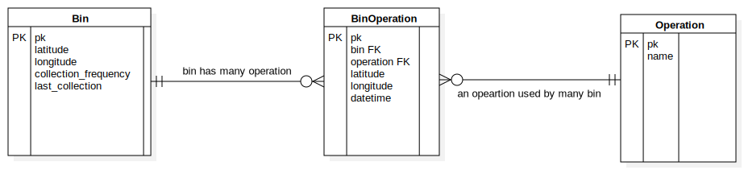
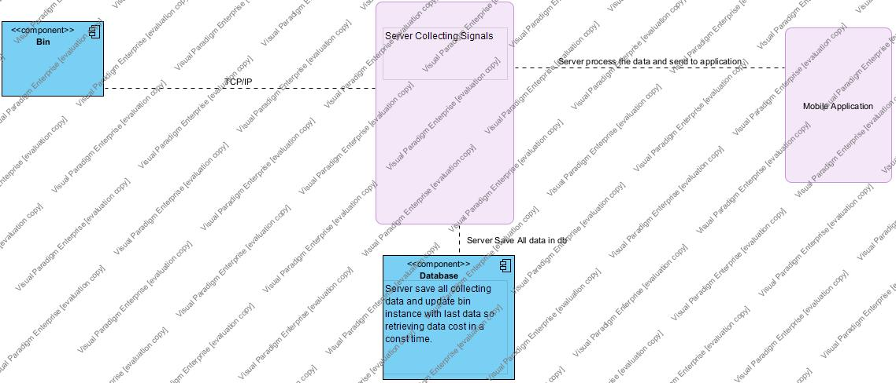

# Evreka Senior Software Developer Evaluation Questions
## Q1.  (Django App named navigation)
<table>
<tr><th>NavigationRecord</th><th>Vehicle</th></tr>
<tr><td>

| field_name |   data_type   |
|------------|:-------------:|
| id         |      PK       |
| vehicle    |      FK       |
| datetime   | DateTimeField |
| latitude   |  FloatField   |
| longitude  |  FloatField   |
</td>
<td>

| field_name | data_type |
|------------|:---------:|
| id         |    PK     |
| plate      | CharField |
</td></tr></table>

- Using the classes above, we want you to create a function that returns the list of last points
per vehicle that have sent navigation data in the last 48 hours. 
- In this function, please implement the necessary queries using Django ORM Framework. 
- This function will return the list that consists of last point objects like the example below. 
- **Note that, because the NavigationRecord model takes too many queries, every query to this model is very costly in
terms of performance.**
- You must use Python as a programming language, Django as a web framework and you can use any database management system.
- We also want you to suggest a different method to get this data in a more efficient way. For
example, you can suggest a tool, architecture, or model structure change.
- For this task, you must deliver the aforementioned function and given models within a git
repository to get the data in a more efficient way, if any. An explanatory document about
your ideas or suggestions is more than welcome.

E.g.
``` json
last_points = [
                {
                    "latitude": 32.32,
                    "longitude": 32.32,
                    "vehicle_plate": "00 ABC 99",
                    "datetime": "03.04.2019 13:27:32"
                    },
                    {
                    "latitude": 33.33,
                    "longitude": 33.33,
                    "vehicle_plate": "99 XYZ 000",
                    "datetime": "05.04.2019 04:32:17"
                    }
                ]
```

````json
[
    {
        "latitude": 88.0,
        "longitude": 99.0,
        "vehicle_plate": "31K1874",
        "datetime": "17.01.22 18:51:32"
    },
    {
        "latitude": 36.0,
        "longitude": 36.0,
        "vehicle_plate": "06CTU395",
        "datetime": "17.01.22 18:22:56"
    }
]
````
# Q2.

<table>
<tr><th>Bin</th><th>Operation</th></tr>
<tr><td>


| field_name           |   data_type   |
|----------------------|:-------------:|
| id                   |      PK       |
| latitude             |  FloatField   |
| longitude            |  FloatField   |
| collection_frequency | IntegerField  |
| last_collection      | DateTimeField |
</td>
<td>

| field_name | data_type |
|------------|:---------:|
| id         |    PK     |
| name       | CharField |

</td>
<td>



</td></tr></table>

In this task, we want you to create a simple database model design. There are already two
models named Bin and Operation as can be seen above.
Beforehand bins were used for only one operation so that there were no operation
models; but from now on, bins will be used for different operations and we must store
collection frequency and last collection time of bins by operation. You must redesign these
models and their fields to provide this ability. If you need to create new fields or new
models, you can create them.
After the database model design, we want you to create a function that returns the list of
collection_frequency values for all Bin-Operation pairs.
For this task, you must deliver an entity-relationship diagram and a function to get the
requested data.

````json
[
    {
        "pk": 1,
        "name": "Bin-1",
        "latitude": 35.0,
        "longitude": 34.0,
        "collection_frequency": 2,
        "last_collection": "17.01.22 22:51:29",
        "operations": [
            {
                "operation": "Tamir",
                "frequency": 2
            }
        ]
    },
    {
        "pk": 2,
        "name": "Bin-2",
        "latitude": 45.0,
        "longitude": 46.0,
        "collection_frequency": 3,
        "last_collection": "17.01.22 22:51:48",
        "operations": [
            {
                "operation": "Tamir",
                "frequency": 1
            },
            {
                "operation": "Boya",
                "frequency": 2
            }
        ]
    }
]
````


## Q3.  (Django App named bin)
Think of a complex system in which raw data is collected via sensors placed in the bins all
over the world. There are a thousand sensors and these sensors measure fullness rate and
temperature 12 times per hour.
It is known that within the next 3 months, the number of sensors will become 100
thousand, and data retrieved from sensors will increase proportionally.

### Information and Requirements
1. Measured data are sent to the servers and processed to use them in a monitoring,
optimization, and tracking system. With the help of this system,
   - Supervisors/managers of waste management companies or municipalities
   set the working hours and days of drivers, create routes, monitor how much
   bins are visited by waste-collecting vehicles, and measure the performance of
   the drivers.
   - drivers of waste-collecting vehicles will be able to see their routes via an
   application installed into their Android devices.
2. System uptime must be over 99.99%. Therefore, in a month the system can be down
at most 40 minutes.
3. When the sensor amount increases to 100 thousand, it is expected that the
response times will not increase.
4. Supervisors/managers must be able to watch the live location of waste-collecting
vehicles via the web application. The latency between the actual location of the
vehicle and the image on the web application must be at most 20 seconds.
### Essentials
1. Consider each part of the system except the hardware system and implement software architecture and design.
2. List the technologies, and explain the reasons behind using the technologies to present the solution clearly. 
Any rational assumption is more than welcome if you  state the logic behind your assumption.
3. Communicate a diagram like the UML Component Diagram or UML Deployment Diagram which shows 
the schema of the system as a big picture and detailed
diagrams which shows the inner parts of the software related components in the big picture you draw.
** Note that the questions are not related to each other, please consider the questions separately. **
